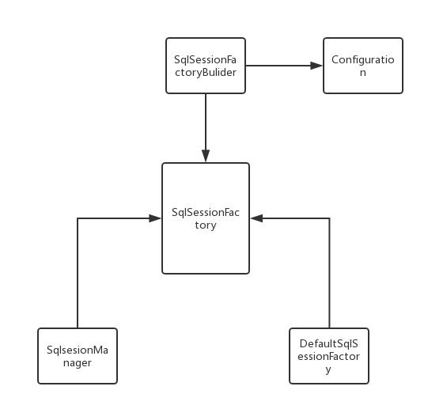
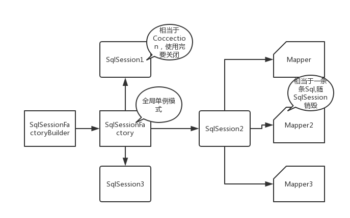

## mybatis基本组成
对于MyBatis的掌握，我们从核心组件开始 
* SqlSessionFactoryBuilder(构造器):它会根据配置信息或者代码来生成SqlSessionFacrtory(工厂接口)
* SqlSessionFactory:依靠工厂来生成SqlSession(会话)
* SqlSession:发送sql去执行并且返回结果，也可以获取mapper的接口
* SQL Mapper:MyBatis的新组件，java接口+XML文件/注解，负责发送Sql去执行，并且返回结果
### 构建SqlSessionFactory
* SqlSessionFactory构建方式
  * Xml配置方式（推荐使用：便于维护/避免硬编码）
  ```
  1.配置mybaits.cfg.xml文件
  <?xml version="1.0" encoding="UTF-8" ?>
  <!DOCTYPE configuration
          PUBLIC "-//mybatis.org//DTD Config 3.0//EN"
          "http://mybatis.org/dtd/mybatis-3-config.dtd">
  <configuration>
      <settings>
          <setting name="logImpl" value="LOG4J"/>
      </settings>
      <!--定义别名-->
     <typeAliases>
         <typeAlias alias="roles" type="com.zccoder.mybatis1.ch2.hello.po.Role"></typeAlias>
     </typeAliases>
      <!--定义数据库信息，默认使用 dev 数据库构建环境-->
      <environments default="dev">
          <environment id="dev">
              <!--采用 JDBC 事务管理-->
              <transactionManager type="JDBC">
                  <property name="autoCommit" value="false"/>
              </transactionManager>
              <!--配置数据库链接信息-->
              <dataSource type="POOLED">
                  <property name="driver" value="com.mysql.jdbc.Driver"/>
                  <property name="url" value="jdbc:mysql://47.98.132.196:3306/vueblog"/>
                  <property name="username" value="root"/>
                  <property name="password" value="anjie123B"/>
              </dataSource>
          </environment>
      </environments>
      <!--定义映射器-->
      <mappers>
          <!--定义某一个 Mapper.xml-->
          <!--<mapper resource="com/zccoder/mybatis1/ch1/abstracts/mapper/RoleMapper.xml" />-->
          <!--扫描该包下的所有 Mapper.xml-->
          <package name="com.zccoder.mybatis1.ch2.hello.mapper"/>
      </mappers>
  
  </configuration>
  2.引入配置xml文件，创建工厂对象
    public static SqlSessionFactory  getSqlSessionFactoryByXml(){
            String resource="mybatis.cfg.xml";
            InputStream inputStream=null;
            try {
                inputStream=Resources.getResourceAsStream(resource);
            } catch (IOException e) {
                e.printStackTrace();
            }
            SqlSessionFactory sqlSessionFactory = new SqlSessionFactoryBuilder().build(inputStream);
            return sqlSessionFactory;
        }
  ```
  * 代码方式   
  ```
  //构建数据库连接池
          PooledDataSource dataSource=new PooledDataSource();
          dataSource.setDriver("com.mysql.jdbc.Driver");
          dataSource.setUrl("jdbc:mysql://47.98.132.196:3306/vueblog");
          dataSource.setUsername("root");
          dataSource.setPassword("anjie123B");
          //创建数据库事物
          TransactionFactory transactionFactory=new JdbcTransactionFactory();
          //创建数据库运行环境
          Environment environment=new Environment("dev",transactionFactory,dataSource);
          //构建configuration对象
          Configuration configuration=new Configuration(environment);
          //注册一个mybaitis上下文别名
          configuration.getTypeAliasRegistry().registerAlias("roles",Role.class);
          //加入映射器
          configuration.addMapper(RoleMapper.class);
          configuration.addMapper(RoleMapperAnno.class);
          //使用sqlsessionFactoryBuilder构建sqlsessionFactory
          SqlSessionFactory sqlSessionFactory = new SqlSessionFactoryBuilder().build(configuration);
          return sqlSessionFactory;
  ```
#### 俩个SqlSessionFactroy显示类的关系图

* Configuration类:对象存在于整个Mybatis生命周期，解析xml配置文件保存到Configuration类对象中
* 俩个SqlSessionFactroy实现类：SqlSessionManager+DefaultSqlSessionFactory
### 创建SqlSession
```
 // 定义 SqlSession
        SqlSession sqlSession = null;
        try {
            // 打开 SqlSession 会话
            sqlSession = MyBatisUtil.getSqlSessionFactoryByXml().openSession();
            // some code ...
            sqlSession.commit();
        }catch (Exception e){
            System.err.println(e.getMessage());
            sqlSession.rollback();
        }finally {
            // 在 finally 语句中确保资源被顺利关闭
            if (sqlSession != null){
                sqlSession.close();
            }
        }
```
#### 俩种用途
* 创建映射器，映射器通过命名空间+方法名找到sql，发给数据库执行并返回结果
* 直接通过命名信息执行sql返回结果，这是ibaits版本留下的方式
### 映射器
由java接口和xml文件（或注解）共同组成作用如下：
* 定义参数类型
* 描述缓存
* 描述Sql
* 定义查询结果和POJO映射关系
#### 对比xml和注解
+ 注解受限，功能少，xml中mapper内容多够复杂功能强大，xml灵活
+ 动态sql/复杂sql，在java文件中可读性差，增加维护成本
## 生命周期
### 1.SqlSessionFactoryBuilder
+ SqlSessionFactoryBuilder利用xml或者java编码来构建SqlSessionFactory,可以构建多个Factory。
+ 生命周期：存在于方法的局部，作用就是构建SqlSessionFactory对象。
### 2.SqlSessionFactory
+ 作用：创建SqlSession,SqlSession相当于一次会话。
+ 生命周期：存在于整个MyBatis的整个生命周期中（每个应用程序访问数据库，都有使用SqlSessionFactory创建的SqlSession）
+ 注意：一个SqlSessionFactory对应一个数据库连接资源。
    + 如果多次创建同一个数据库的SqlSessionFactory,则每次创建Factory都会创建一个数据库连接，那么数据库连接资源会被耗尽
    + SqlSessionFactroy的职责是唯一的，就是创建SqlSession，因此一般使用单例模式
    ```java
    /**
     * <br>
     * 标题：SqlSessionFactory 工具类<br>
     * 描述：使用单例模式构建 SqlSessionFactory 对象<br>
     *
     * @author zc
     * @date 2018/03/14
     **/
    public class SqlSessionFactoryUtil {
    
        /**
         * SqlSessionFactory 对象
         */
        private static SqlSessionFactory sqlSessionFactory = null;
    
        /**
         * 类线程锁
         */
        private static final Class CLASS_LOCK = SqlSessionFactoryUtil.class;
    
        /**
         * 私有化无参构造方法
         */
        private SqlSessionFactoryUtil() {
        }
    
        public static SqlSessionFactory initSqlSessionFactory(){
            String resource = "mybatis.cfg.xml";
            InputStream inputStream = null;
            try {
                inputStream = Resources.getResourceAsStream(resource);
            } catch (IOException e) {
                Logger.getLogger(SqlSessionFactoryUtil.class.getName()).log(Level.SEVERE,null,e);
            }
            synchronized (CLASS_LOCK){
                if (sqlSessionFactory == null){
                    sqlSessionFactory = new SqlSessionFactoryBuilder().build(inputStream);
                }
            }
            return sqlSessionFactory;
        }
    
        public static SqlSession openSqlSession(){
            if (sqlSessionFactory == null){
                initSqlSessionFactory();
            }
            return sqlSessionFactory.openSession();
        }
    }

    ```
### 3.SqlSession
+ SqlSession是一个会话，相当于JDBC的Connection，
+ 生命周期：请求数据库处理事务的过程中，可以执行多条Sql保证事务一致性
+ 线程不安全，操作数据库要注意隔离级别，线程锁
+ 创建使用之后要关闭SqlSession。因为Session长期存在会使数据库连接池活动资源减少，对性能有影响
### 4.Mapper
+ Mapper是一个接口，没有任何实现类
+ 作用：发送Sql，然后返回需要的结果，或者执行数据库修改操作
+ 生命周期：存在于一个SqlSession事务方法内，是一个方法级别的东西



